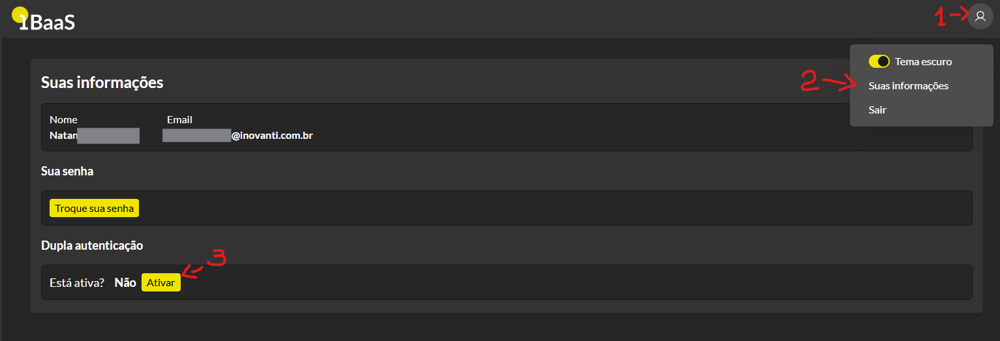
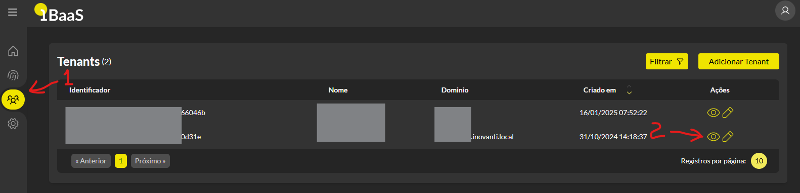
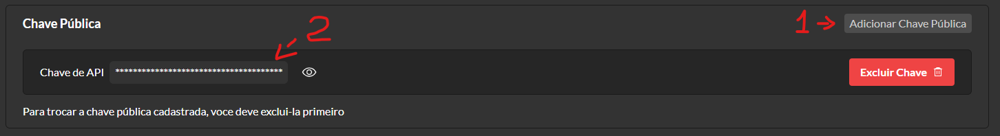

## AaaS Client

Este projeto fornece uma interface Laravel para testar chamadas de IAaas e IBaas.

Com ele, é possível:

- escolher o serviço (`IAaas` ou `IBaas`) no header da interface;
- testar endpoints dos dois serviços sem misturar as listas;
- usar JWT assinado apenas no fluxo do `IAaas`;
- usar login/refresh/logout do `IBaas` com sessão de token.

## Requisitos

- PHP 8.2 ou superior
- Composer
- Node.js 20+ e npm
- Banco de dados configurado conforme o arquivo `.env`
- OpenSSL disponível no ambiente para geração das chaves


## Configuração

### 1. Clonar o projeto

```bash
$ git clone https://github.com/Inovanti-Bank/aaas-client.git
$ cd aaas-client
```

### 2. Instalar as dependências

```bash
$ composer install
```

### 3. Configurar o ambiente e executar os comandos do Artisan

Copie o arquivo de exemplo e ajuste as variáveis do ambiente:

```bash
$ cp .env.example .env
```

Em seguida, execute os comandos básicos do Laravel:

```bash
$ php artisan key:generate
$ php artisan migrate
```

### 4. Gerar o par de chaves

Para autenticar as chamadas à API do IBaaS, gere um par de chaves ECDSA.

Esse comando é responsável pela geração da chave privada:

```bash
$ ssh-keygen -t ecdsa -b 521 -m PEM -f jwtECDSASHA512.key
```

A partir da chave privada, gere a chave pública:

```bash
$ openssl ec -in jwtECDSASHA512.key -pubout -outform PEM -out jwtECDSASHA512.key.pub
```

### 5. Armazenar as chaves no projeto

Coloque os arquivos gerados no diretório `storage/keys`.

Exemplo esperado:

- `storage/keys/jwtECDSASHA512.key`
- `storage/keys/jwtECDSASHA512.key.pub`

Se necessário, crie a pasta manualmente:

```bash
$ mkdir -p storage/keys
```

### 6. Configurar os caminhos das chaves no `.env`

Copie o caminho completo dos arquivos e configure as variáveis abaixo:

```dotenv
JWT_PRIVATE_KEY_PATH=/caminho/completo/para/storage/keys/jwtECDSASHA512.key
JWT_PUBLIC_KEY_PATH=/caminho/completo/para/storage/keys/jwtECDSASHA512.key.pub
```

### 7. Configurar a URL base do ambiente

Altere a variável `BASE_URL` no arquivo `.env` para apontar para o ambiente correto do IBaaS:

```dotenv
BASE_URL=https://seu-ambiente-ibaas
```

### 8. Chave e API Key para IAaas

### Envio da chave pública no painel (IAaas)

A chave pública deve ser enviada pelo painel de controle para uso no fluxo IAaas.

### Pré-requisito: ativar dupla autenticação com TOTP

Para manter o nível de segurança exigido, o envio da chave pública só pode ser realizado quando a autenticação em dois fatores com TOTP estiver ativa.

Para ativar:

1. Acesse o painel com as credenciais recebidas.
2. Clique no ícone do canto superior direito e acesse **Suas informações**.
3. No submenu **Dupla autenticação**, clique em **Ativar**.
4. Escaneie o QR Code com um aplicativo de TOTP, como Google Authenticator ou Microsoft Authenticator.
5. Informe o código gerado e confirme a ativação.
6. Salve as chaves de recuperação em local seguro.



### Importar a chave pública na tenant

Após ativar o TOTP:

1. Acesse o menu lateral **Tenants**.
2. Clique em **Ver tenant** na tenant desejada.



3. Clique em **Adicionar Chave Pública**.
4. Cole o conteúdo da sua chave pública.
5. Confirme em **Adicionar**.



6. Após o cadastro, a chave será salva e a `API_KEY` será disponibilizada.

## Execução do projeto

Para subir o ambiente local:

```bash
$ php artisan serve
```

Depois disso, acesse o endereço exibido no terminal, normalmente `http://127.0.0.1:8000`.

Configure no `.env` as credenciais por serviço:

```dotenv
API_KEY_IAAAS=sua_api_key_iaaas
```

## Variáveis de ambiente importantes

As principais variáveis utilizadas neste projeto são:

```dotenv
JWT_PRIVATE_KEY_PATH=/home/seu-usuario/projeto/storage/keys/jwtECDSASHA512.key
JWT_PUBLIC_KEY_PATH=/home/seu-usuario/projeto/storage/keys/jwtECDSASHA512.key.pub
BASE_URL=https://seu-ambiente-ibaas
API_KEY_IAAAS=
```

## Documentação da API IBaaS

A documentação completa da API, incluindo detalhes sobre autenticação e onboarding, está disponível em:

https://share.apidog.com/116b1949-0d4f-4c99-a001-5516d99f904d/doc-830018
