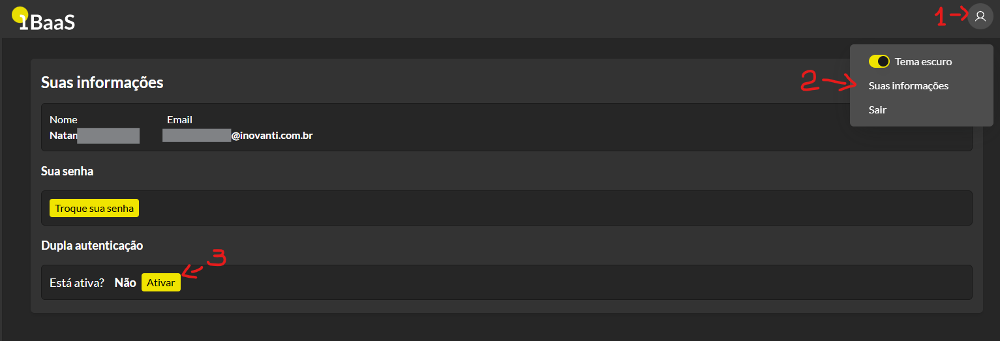
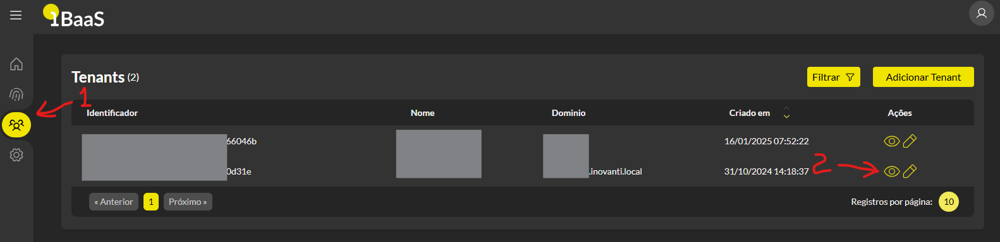
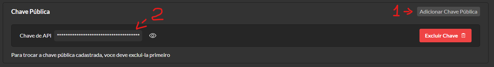

## AaaS Client

Este projeto fornece uma interface Laravel para testar chamadas de IAaas e IBaas.

Com ele, é possível:

- escolher o serviço (`IAaas` ou `IBaas`) no header da interface;
- testar endpoints dos dois serviços sem misturar as listas (com autocomplete agrupado por categoria);
- preencher parâmetros de path (`{account_id}`, `{uuid}`...) em campos próprios;
- usar JWT assinado apenas no fluxo do `IAaas` (com decodificador de payload embutido);
- usar login/refresh/logout do `IBaas` com sessão de token e indicador de sessão sempre visível;
- reaproveitar chamadas anteriores pelo histórico de requisições;
- copiar a requisição enviada como comando cURL;
- alternar entre tema claro/escuro e entre layout com a resposta ao lado ou abaixo do formulário.

## Requisitos

- PHP 8.2 ou superior
- Composer
- Node.js 20+ e npm
- Banco de dados configurado conforme o arquivo `.env`
- OpenSSL disponível no ambiente para geração das chaves


## Configuração

### 1. Clonar o projeto

```bash
$ git clone https://github.com/Inovanti-Bank/aaas-client.git
$ cd aaas-client
```

### 2. Instalar as dependências

```bash
$ composer install
$ npm install
```

### 3. Compilar os assets do frontend

```bash
$ npm run build
```

Durante o desenvolvimento, é possível usar o hot reload com:

```bash
$ npm run dev
```

### 4. Configurar o ambiente e executar os comandos do Artisan

Copie o arquivo de exemplo e ajuste as variáveis do ambiente:

```bash
$ cp .env.example .env
```

Em seguida, execute os comandos básicos do Laravel:

```bash
$ php artisan key:generate
$ php artisan migrate
```

### 5. Gerar o par de chaves

Para autenticar as chamadas à API do IBaaS, gere um par de chaves ECDSA.

Esse comando é responsável pela geração da chave privada:

```bash
$ ssh-keygen -t ecdsa -b 521 -m PEM -f jwtECDSASHA512.key
```

A partir da chave privada, gere a chave pública:

```bash
$ openssl ec -in jwtECDSASHA512.key -pubout -outform PEM -out jwtECDSASHA512.key.pub
```

### 6. Configurar as credenciais do IAaas pela interface

As credenciais do IAaas **não ficam mais no `.env`**. Ao clicar no serviço **IAaas** na interface, um modal solicita a **API Key** e a **chave privada** geradas no passo anterior. Elas ficam salvas na sessão e em cookie (criptografado pelo Laravel) por 7 dias, e podem ser trocadas a qualquer momento pelo botão **Configurar chaves**.

### 7. Configurar a URL base do ambiente

Altere a variável `BASE_URL` no arquivo `.env` para apontar para o ambiente correto do IBaaS:

```dotenv
BASE_URL=https://seu-ambiente-ibaas
```

### 8. Chave e API Key para IAaas


### Envio da chave pública no painel (IAaas)

A chave pública deve ser enviada pelo painel de controle para uso no fluxo IAaas.

### Pré-requisito: ativar dupla autenticação com TOTP

Para manter o nível de segurança exigido, o envio da chave pública só pode ser realizado quando a autenticação em dois fatores com TOTP estiver ativa.

Para ativar:

1. Acesse o painel com as credenciais recebidas.
2. Clique no ícone do canto superior direito e acesse **Suas informações**.
3. No submenu **Dupla autenticação**, clique em **Ativar**.
4. Escaneie o QR Code com um aplicativo de TOTP, como Google Authenticator ou Microsoft Authenticator.
5. Informe o código gerado e confirme a ativação.
6. Salve as chaves de recuperação em local seguro.



### Importar a chave pública na tenant

Após ativar o TOTP:

1. Acesse o menu lateral **Tenants**.
2. Clique em **Ver tenant** na tenant desejada.



3. Clique em **Adicionar Chave Pública**.
4. Cole o conteúdo da sua chave pública.
5. Confirme em **Adicionar**.



6. Após o cadastro, a chave será salva e a `API_KEY` será disponibilizada.

## Execução do projeto

Para subir o ambiente local:

```bash
$ php artisan serve
```

Depois disso, acesse o endereço exibido no terminal, normalmente `http://127.0.0.1:8000`. A API Key e a chave privada do IAaas são configuradas pela própria interface (modal do serviço IAaas).

## Variáveis de ambiente importantes

As principais variáveis utilizadas neste projeto são:

```dotenv
BASE_URL=https://seu-ambiente-ibaas
# Opcional: base separada para o IBaas (por padrão usa BASE_URL)
IBAAS_BASE_URL=
# Opcional: Host header usado em requisições para localhost/127.0.0.1
LOCAL_TENANT_DOMAIN=
```

## Testes

```bash
$ php artisan test
```

## Documentação da API IBaaS

A documentação completa da API, incluindo detalhes sobre autenticação e onboarding, está disponível em:

https://share.apidog.com/116b1949-0d4f-4c99-a001-5516d99f904d/doc-830018
